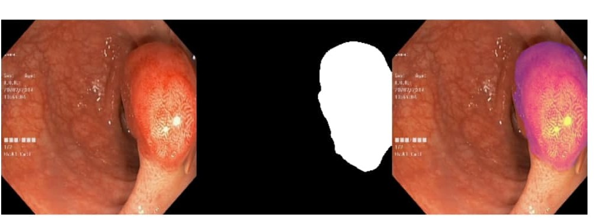
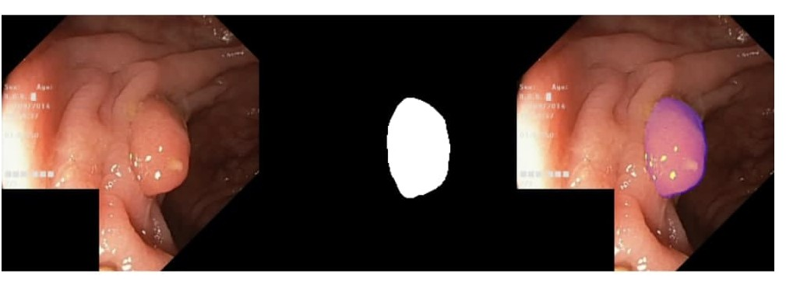
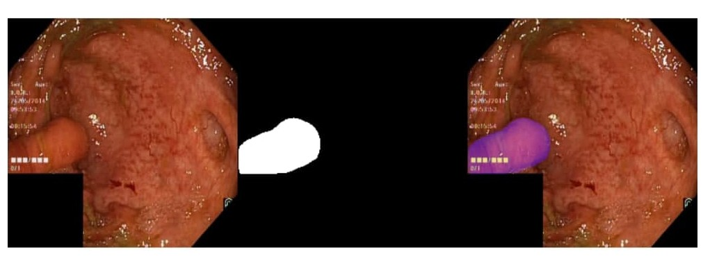
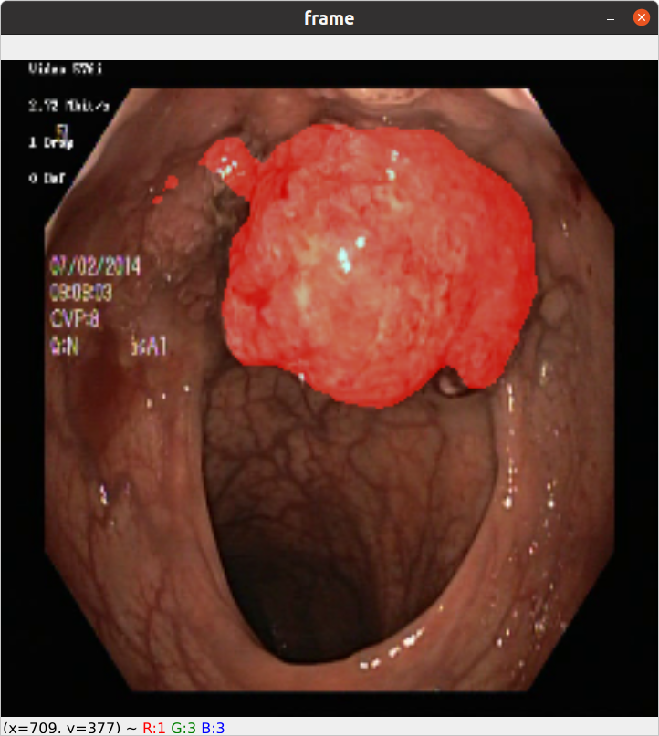
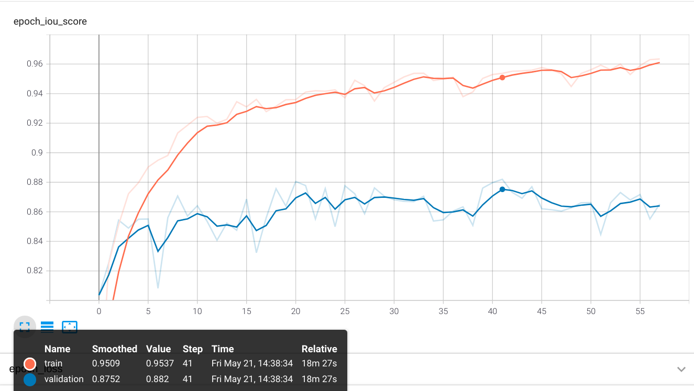
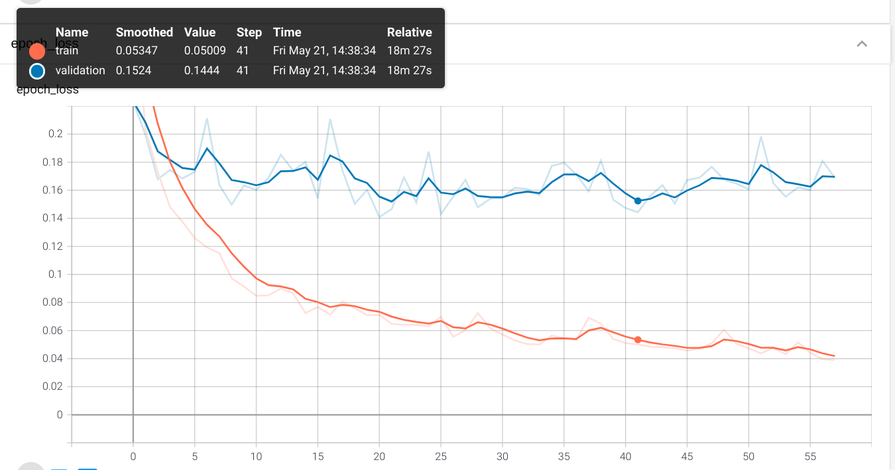

# Polyp segmentation

Scripts for training and testing convolutional neural network for images segmentation.

This script builds models using this library "https://github.com/qubvel/segmentation_models". Using this library made 
it possible to quickly test various models and choose the best option for solving the segmentation task.

You can view or set parameters in config.py
    
To train the model, the "Hyper-Kvasir Dataset" was used.
> https://datasets.simula.no/hyper-kvasir/

## 1. Dataset preparation
My dataset has this configuration:
```
data/
    masks/
            cju0qkwl35piu0993l0dewei2.jpg
            cju0qoxqj9q6s0835b43399p4.jpg
            ...    
    images/
            cju0qkwl35piu0993l0dewei2.jpg
            cju0qoxqj9q6s0835b43399p4.jpg
            ...
``` 
Run this script to prepare dataset for training and testing with default settings:

```shell script
python data_preparation.py
```
## 2. Training
Run training script with default parameters:
```shell script
python train.py --train
```
If you want to make a training with a different input resolution, then you can use:
```shell script
python train.py --train_dif_shape
```
## 3. Plotting graphs
If you want to build graphs from saved logs, you can use tens or board by passing the path to the logs folder.
```shell script
tensorboard --logdir models_data/Unet_resnet18_2021-06-05_15-53-19_shape-256-256/logs
```
## 4. Testing
You can test the trained model on video.
For the video test, you will need two arguments "--weights " and "'--path_video". 
```shell script
 python test.py --path_video /data/test_video/vid_2.avi  --weights models_data/Unet_resnet18_2021-06-12_16-34-59_shape-256-256/save_models/Unetresnet18.h5
```
If you want to calculate the average value of losses and indicators on val_data, you should use --metrics and --weights.
```shell script
python test.py --metrics --weights models_data/Unet_resnet18_2021-06-12_16-34-59_shape-256-256/save_models/Unetresnet18.h5
```
If you want to calculate the average inference time and average fps and indicators on val_data, you should use --time and --weights.
```shell script
python test.py --time --weights models_data/Unet_resnet18_2021-06-12_16-34-59_shape-256-256/save_models/Unetresnet18.h5
```
If you want to use gpu for test, you should use --gpu with number gpu. If you don't want to use the gpu then you don't need to specify this parameter.
```shell script
python test.py --gpu 0 test.py --path_video /data/test_video/vid_2.avi  --weights models_data/Unet_resnet18_2021-06-12_16-34-59_shape-256-256/save_models/Unetresnet18.h
```
Image segmentation, example.
 






The frame from the test video is shown below.



## Results
### Model Unet with backbone efficientnetb0.
The graphs show metrics during model training with loaded "imagenet" weights. The orange line is train, the blue 
line is val
Prediction examples:

This is iou_score metric.


This is loss.


The table displays the resulting metrics and other information on a validation dataset consisting of 799 images. All 
models used weights "imagenet" and the Adam optimizer with a learning rate 0.0001. These results are averaged.

|    Name Model      | Loss     | Accuracy |   IoU   |   Precision  |  Recall  | F1-score  |Mean inference time | Mean FPS | Image Shape  |
|:------------------:|:--------:|:--------:|:-------:|:------------:|:--------:|:---------:|:------------------:|:--------:|:------------:|
|resnet18            | 0.1558   | 0.9645   | 0.8651  | 0.9174       |0.9337    |     0.9106|      0.0237        |     42.25| (256, 256, 3)|          
|resnet18            | 0.2035   | 0.9569   |0.8619   |   0.9228     |0.9234    |  0.9076   | 0.0247             | 40.55    | (320, 320, 3)|
|resnet18            | 0.1480   |0.9638    |0.8774   |0.9261        |0.9390    | 0.9240    | 0.0254             | 39.29  | (384, 384, 3)|
|resnet18            | 0.1182   |0.9696    |0.8905   |0.9367        |0.9398    | 0.9309    |0.0283              | 35.36    | (448, 448, 3)|
|resnet18            | 0.1384   |0.9636    |0.8653   |0.9154        |0.9408    |0.9408     | 0.0289             | 34.61    | (512, 512, 3)|
|seresnet18          | 0.2055   | 0.9565   |0.8461   |   0.9220     | 0.9049   |0.8904     |     0.0248         |   40.37  | (256, 256, 3)|
|seresnet18          |  0.1815  | 0.9577   |  0.8611 |  0.9233      |0.9278    | 0.9084    |0.0256              | 39.00    |(320, 320, 3) |
|seresnet18          |  0.1830  |   0.9524 |  0.8482 | 0.9041       |  0.9227  | 0.9001    | 0.0262             | 38.14    |(384, 384, 3) |
|seresnet18          | 0.1695   | 0.9586   | 0.8697  | 0.9249       |0.9387    | 0.9202    |0.0288              | 34.71    |(448, 448, 3) |
|seresnet18          | 0.1815   | 0.9549   |  0.8617 |0.9144        | 0.9388   |  0.9153   |0.0297              | 33.62    |(512, 512, 3) |
|mobilenetv2         | 0.1784   |0.9653    | 0.8810  | 0.9307       |0.9350    | 0.9228    |0.0256              |39.04     | (256, 256, 3)|
|mobilenetv2         | 0.1654   | 0.9634   | 0.8742  |0.9261        | 0.9373   |0.9174     | 0.0260             | 38.40    | (320, 320, 3)|
|mobilenetv2         | 0.1456   | 0.9617   | 0.8728  | 0.9156       | 0.9497   | 0.9207    |0.0272              | 36.73    | (384, 384, 3)|
|mobilenetv2         | 0.1598   | 0.9622   | 0.8709  | 0.9210       | 0.9333   | 0.9162    |0.0293              | 34.11    | (448, 448, 3)|
|mobilenetv2         |0.2248    | 0.9525   | 0.8640  |0.9214        |0.9331    | 0.9137    |0.0306.             |32.70     | (512, 512, 3)|
|efficientnetb0      |0.1941    |0.9598    |0.8745   |0.9275        |0.9380    |0.9192     |0.0301              |33.17     |(256, 256, 3) |
|efficientnetb0      | 0.1575   |0.9621    |0.8770   | 0.9288       |  0.9424  |0.9254     |0.0304              |32.90     |(320, 320, 3) |
|efficientnetb0      |0.1379    |0.9683    |0.8905   | 0.9378       |0.9469    |0.9324     |0.0323.             |30.99     |(384, 384, 3) |
|efficientnetb0      | 0.1526   |0.9659    | 0.8921  |0.9356        | 0.9381   | 0.9474    | 0.0348             |28.75     |(448, 448, 3) |
|efficientnetb0      |0.1765    | 0.9599   |0.8694   |  0.9318      |  0.9294  | 0.9162    |0.0337              | 29.63    |(512, 512, 3) |
